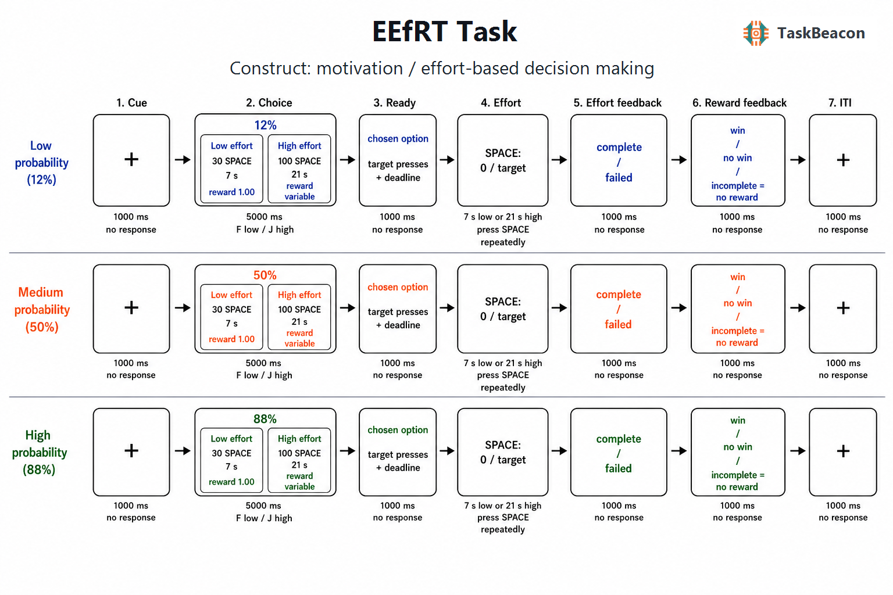

# 努力—奖赏权衡的行为测量：EEfRT 范式的理论基础、实证进展与解释边界

目标导向行为要求个体把潜在收益与行动成本整合为可执行的选择。快感缺失、意志减退和疲劳相关症状均可能表现为活动减少，但观察到的低活动水平不能区分奖赏价值表征减弱、努力成本估计升高、成功概率利用不足、运动能力受限或状态性动机波动。努力奖赏任务（Effort Expenditure for Rewards Task, EEfRT）通过在同一试次内正交操纵奖赏幅度与获奖概率，并要求参与者在低努力—低奖赏和高努力—高奖赏方案之间选择，为“是否愿意付出努力”提供了可重复的操作化指标（Treadway et al., 2009）。该范式的主要价值在于考察奖赏信息如何改变努力分配，而非把高努力选择率直接等同于一般动机或某种疾病特征。其效度判断需要同时结合试次操作、行为指标、神经证据、应用场景与测量边界。

## 1. 范式提出与理论背景

EEfRT 源自啮齿动物并行选择范式所揭示的努力相关决策：当较大收益必须以较高行动成本获得时，多巴胺功能变化会改变动物对高成本选项的选择。Treadway 等人将这一逻辑转化为人类多试次按键任务，旨在弥补抑郁和快感缺失研究过度依赖自陈量表的问题（Treadway et al., 2009）。其核心命题是，奖赏的主观价值会受到获得概率和行动成本共同折减；若参与者能利用概率与幅度信息，则高努力选择应随高努力方案奖赏和获奖概率增加而上升。原始研究还发现特质快感缺失与努力投入意愿负相关，但这一关联属于初步构念效度证据，不能把单一选择比例解释为快感缺失的客观诊断。

后续药理和分子影像研究使 EEfRT 成为连接动物模型与人类动机研究的重要工具。小样本重复测量研究显示，右旋安非他明提高了高努力方案的选择，并改变参与者对奖赏幅度的利用（Wardle et al., 2011）。另一项正电子发射断层扫描（positron emission tomography, PET）研究发现，左侧纹状体和腹内侧前额叶的多巴胺反应与高努力选择正相关，双侧岛叶的相应关联方向相反，且部分效应在低获奖概率条件更明显（Treadway, Buckholtz, et al., 2012）。这些结果支持儿茶酚胺系统参与成本—收益整合，但相关性 PET 指标与具有多重作用靶点的药物操纵都不足以证明某一脑区或单一递质过程专门决定 EEfRT 表现。

## 2. 经典任务逻辑、流程与指标

原始 EEfRT 每个试次先呈现 1 秒注视点，随后在最长 5 秒的选择阶段同时给出本试次获奖概率以及高努力方案的奖赏额。低努力方案要求参与者用优势手食指在 7 秒内按键 30 次，成功后有机会获得固定 1 美元；高努力方案要求用非优势手小指在 21 秒内按键 100 次，对应 1.24—4.30 美元的可变奖赏。两种方案共享同一获奖概率，分为 12%、50% 和 88% 三级。选择后呈现 1 秒准备屏，参与者完成所选按键要求，随后收到完成与否以及是否获奖的反馈；5 秒内未选择时由程序随机指定方案。任务通常限定为 20 分钟，因此完成试次数随选择和执行速度变化，最终报酬取自随机抽取的获奖试次（Treadway et al., 2009）。

主要因变量是高努力选择率，并可按概率、奖赏幅度或二者组合分层。试次水平分析通常以是否选择高努力方案为二元结果，用广义估计方程、混合效应逻辑回归或计算模型估计奖赏幅度、概率、试次进程及其交互作用。`高奖赏 > 低奖赏` 与 `高概率 > 低概率` 对高努力选择的促进反映参与者利用收益信息调节努力分配；它们不能彼此替代，也不等同于完成高努力动作的运动能力。选择反应时、完成率、按键速度、累积奖赏及随试次增加的选择变化可作为补充指标。完成率和按键速度主要反映执行能力与疲劳，前一试次反馈效应还可能混合强化学习、情绪反应和策略调整。

固定总时长使高、低努力方案同时具有机会成本差异：高努力试次耗时更长，可能减少随后可进入的试次数。参与者若意识到这一结构，可能为最大化单位时间收益而选择低努力方案。由此，高努力选择率代表概率、奖赏、体力成本、时间成本与策略的联合结果。固定试次数、个体化运动校准、连续努力量和认知努力版本均试图分离这些成分，但修改后的指标不应默认与原始 EEfRT 等价。认知版 EEfRT（C-EEfRT）以认知负荷替代重复按键，参与者在低概率或低奖赏条件下对认知努力的接受度高于身体努力，提示努力领域会改变选择基线（Lopez-Gamundi & Wardle, 2018）；直接比较研究虽发现身体与认知努力折减存在一定个体一致性，结论仍依赖任务匹配和模型设定（Lim et al., 2023）。

## 3. 主要行为与神经科学发现

### 3.1 奖赏信息利用与临床差异

健康样本中最稳定的行为结果是高努力选择随奖赏幅度和获奖概率增加而上升，说明任务能够诱发预期的成本—收益权衡（Treadway et al., 2009; Ohmann et al., 2022）。高努力选择减少可能来自整体努力接受偏向降低，也可能表现为对高价值条件的反应不足。仅报告全任务平均值会掩盖二者差异，因此概率和奖赏斜率、关键条件对比以及完成率应与总体高努力选择率共同报告。

抑郁研究最初发现，重性抑郁障碍组较少选择高努力方案，差异在高概率、高奖赏条件尤为明显，支持动机性快感缺失涉及把潜在收益转化为行动的困难（Treadway, Bossaller, et al., 2012）。近期对未服药缓解期抑郁个体的计算分析同样观察到总体高努力选择较少；控制残余快感缺失后组间差异减弱，而且缓解组在高奖赏—高概率条件下仍能增加努力。漂移扩散模型提示其决策证据存在偏向低努力方案的倾向，同时保留对高价值条件的调节（Kuhn et al., 2025）。当前证据因症状状态、药物、任务版本与模型不同而存在异质性，尚不能把“抑郁”归结为单一的奖赏敏感性缺陷。

精神分裂症研究进一步显示，异常表现常集中于高价值条件的信息利用。患者在 EEfRT 中较少依据概率和奖赏幅度增加努力，相关指标与临床评定的意志减退和功能受损存在关联（Barch et al., 2014）。多范式比较发现，努力决策指标与阴性症状、动机和社区功能多为小到中等相关，不同任务之间虽有关联但并非同一测量（Horan et al., 2015）。纳入 20 项研究、其中 14 项使用 EEfRT 的元分析报告精神分裂症组努力分配下降的中等效应量，并发现阴性症状严重度与努力投入负相关；研究间任务参数、样本与治疗状态仍限制个体层面的临床推断（Blouzard et al., 2023）。

### 3.2 PET、fMRI 与 EEG 所揭示的阶段性过程

EEfRT 的神经证据需要按选择、努力执行和结果反馈阶段区分。PET 结果把个体多巴胺反应与跨试次高努力选择联系起来，提供了神经化学层面的关联证据，但其时间分辨率不能分离单次试次中的价值比较和动作准备（Treadway, Buckholtz, et al., 2012）。采用个体化按键要求的功能磁共振成像（functional magnetic resonance imaging, fMRI）变式发现，努力、概率和时间折减虽在行为上相对独立，其主观价值均与内侧前额叶活动相关（Seaman et al., 2018）。该结果支持不同成本可汇入部分共享的价值表征网络；由于任务参数经过调整且 BOLD 信号为相关指标，不能据此把内侧前额叶视为努力选择的专属或因果节点。

脑电图（electroencephalography, EEG）证据为阶段分离提供了更直接的时间信息。EEfRT 的事件相关电位变式显示，困难选择后的反馈预期阶段具有更负的刺激前负波，获奖相较未获奖反馈诱发更大的中央—顶叶 P300；源定位结果只宜作为候选发生源，不能由头皮信号精确确定岛叶或腹内侧前额叶活动（Giustiniani et al., 2020）。另一项研究在困难试次的动作准备期观察到更强的中央—顶叶 β 频段去同步化，说明高努力条件同时改变运动准备过程（Wilhelm et al., 2021）。因此，EEG 差异既可能反映动机价值，也可能受按键侧别、动作难度和运动执行影响；现有任务特异 EEG 样本和独立复现仍少于行为研究。

## 4. 范式发展与主要应用

EEfRT 已从快感缺失研究扩展至精神病谱系、物质使用、炎症与疲劳等领域，并被用于比较药理、临床和跨诊断差异。其方法学进展主要体现为对潜在成分的拆分：运动能力校准控制按键上限，固定试次数削弱时间机会成本，连续努力设计把二元选择扩展为投入量，认知版则检验身体和认知成本能否共享评价过程。上述变化提高了针对特定问题的可识别性，同时降低了跨版本直接合并的合理性。

临床应用中，应优先分析症状维度与条件敏感性，而不是把患者—对照均值差异作为诊断标志。多任务研究发现 EEfRT 与自陈动机指标、其他努力任务的关联有限且不稳定（Renz et al., 2023）；这表明行为选择、自我体验和观察者评定覆盖重叠但不同的测量内容。对治疗或纵向变化的研究还应区分状态变化与稳定个体差异，并报告药物、运动能力、疲劳和实际金钱激励。只有在相同版本、相同支付规则和充分试次数下，重复测量变化才具有明确含义。

## 5. 测量效度与解释边界

现有心理测量证据支持总体高努力选择率的分半信度。两个健康样本中，原始 EEfRT 总体高努力选择率的校正分半信度约为 .87—.90；按单一概率或奖赏水平计算的指标多数也较高。概率或奖赏条件差值的信度范围更宽，部分仅约 .35—.40，说明稳定的总体选择倾向并不保证个体条件敏感性同样可靠（Ohmann et al., 2022）。这些结果属于同次测量内部一致性，不能替代跨日重测信度。若研究问题关注个体差异或治疗反应，应预先选择指标并估计本样本的重测误差，而不宜事后从多个差值中筛选显著结果。

构念效度的限制更为实质。概率同时引入风险或不确定性，高努力方案同时增加按键次数、非优势手动作难度和占用时间；奖赏额的主观价值还受收入、货币单位和支付可信度影响。原始任务中总体选择与奖赏、概率的关系较稳定，但与行为趋近系统、预期愉悦等自陈特质的相关在大样本中未稳定复现（Ohmann et al., 2022），多种努力任务与自陈意志减退的收敛也较弱（Renz et al., 2023）。高努力选择率因此适合解释为特定规则下的努力分配，而非纯粹的“动机强度”。临床组差异也可能来自运动迟缓、认知理解、药物、疲劳、风险偏好或策略；群体效应不能用于个体诊断，相关神经活动不能升级为病因机制。

## 6. TaskBeacon 中的任务实现

### 6.1 任务资源与访问入口

| 资源 | ID | 用途 | 地址 |
|---|---|---|---|
| 完整行为实验实现 | T000019 | PsychoPy/PsyFlow 本地实验与数据采集 | [GitHub 源码](https://github.com/TaskBeacon/T000019-eefrt) |
| 浏览器预览源码 | H000019 | 基于 psyflow-web 的浏览器预览；不替代实验室运行时与时序控制 | [GitHub 源码](https://github.com/TaskBeacon/H000019-eefrt) |

### 6.2 实现流程与关键参数

TaskBeacon 当前版本为中文行为任务，共 1 个区块、48 个试次。每个 12%、50%、88% 概率水平与八级高努力奖赏各组合两次并随机排序。该实现固定试次数而不固定 20 分钟总时长，因而削弱了原始范式中“选择高努力会减少可完成试次数”的机会成本；低、高努力执行均使用空格键，也取消了原始范式的手指侧别差异。两项改变有利于流程标准化，但所得高努力选择率与完全复刻原始版本的数据不宜直接合并。

| 环节 | 当前参数与规则 |
|---|---|
| 方案 | 低努力：7 秒内按空格 30 次，成功奖赏 ¥1.00；高努力：21 秒内按空格 100 次，奖赏为 ¥1.24、1.68、2.11、2.55、2.99、3.43、3.86 或 4.30 |
| 概率 | 12%、50%、88%；同一试次的低、高努力方案共享该概率 |
| 时序 | 注视 1 秒；选择最长 5 秒；准备 1 秒；执行 7 或 21 秒；完成反馈 1 秒；奖赏反馈 1 秒；试次间隔 1 秒 |
| 反应与超时 | F 选择低努力，J 选择高努力；执行阶段连续按空格；选择超时后按预生成的 50% 概率规则指定低或高努力方案 |
| 反馈与计分 | 达到按键阈值后才按本试次概率抽取获奖结果；未完成或未中奖均记 ¥0；汇总高努力选择率、完成率和累计奖赏 |
| 自适应 | 不使用自适应控制器；试次概率、奖赏组合和随机结果在运行前生成 |

**图 1. TaskBeacon 当前 EEfRT 单试次流程。** 每个试次依次经历 1 秒注视、最长 5 秒方案选择、1 秒准备、努力执行、1 秒完成反馈、1 秒奖赏反馈和 1 秒试次间隔。蓝、橙、绿三行分别对应 12%、50% 和 88% 获奖概率；各概率条件下均以 F 键选择低努力方案（7 秒内按空格 30 次，成功后候选奖赏固定为 ¥1.00），或以 J 键选择高努力方案（21 秒内按空格 100 次，候选奖赏从八级金额中取值）。执行阶段实时显示按键进度和剩余时间。达到阈值后依据预生成的随机数与本试次概率判定获奖，未达到阈值则直接记为零奖赏；5 秒选择窗内无有效反应时，程序依据预生成的等概率备用方案继续试次。该版本不实施基于表现的难度或时限自适应。

当前记录支持在试次层面分析方案概率、高努力奖赏、选择及反应时、是否由超时指定方案、要求与实际按键数、首次按键反应时、完成状态、是否获奖和奖赏额。现有仓库文件无法确认屏幕累计的人民币奖赏是否兑换为实际报酬；正式研究需在方案和知情同意中明确支付规则，因为真实激励与虚拟积分可能改变奖赏价值及跨研究可比性。

## 参考文献

Barch, D. M., Treadway, M. T., & Schoen, N. (2014). Effort, anhedonia, and function in schizophrenia: Reduced effort allocation predicts amotivation and functional impairment. *Journal of Abnormal Psychology, 123*(2), 387–397. https://doi.org/10.1037/a0036299

Blouzard, E., Pouchon, A., Polosan, M., Bastin, J., & Dondé, C. (2023). Effort-cost decision-making among individuals with schizophrenia: A systematic review and meta-analysis. *JAMA Psychiatry, 80*(6), 548–557. https://doi.org/10.1001/jamapsychiatry.2023.0553

Giustiniani, J., Nicolier, M., Teti Mayer, J., Chabin, T., Masse, C., Galmès, N., Pazart, L., Trojak, B., Bennabi, D., Vandel, P., Haffen, E., & Gabriel, D. (2020). Event-related potentials (ERP) indices of motivation during the Effort Expenditure for Reward Task. *Brain Sciences, 10*(5), 283. https://doi.org/10.3390/brainsci10050283

Horan, W. P., Reddy, L. F., Barch, D. M., Buchanan, R. W., Dunayevich, E., Gold, J. M., Marder, S. R., Wynn, J. K., Young, J. W., & Green, M. F. (2015). Effort-based decision-making paradigms for clinical trials in schizophrenia: Part 2—External validity and correlates. *Schizophrenia Bulletin, 41*(5), 1055–1065. https://doi.org/10.1093/schbul/sbv090

Kuhn, M., Palermo, E. H., Pagnier, G., Blank, J. M., Steinberger, D. C., Long, Y., Nowicki, G., Cooper, J. A., Treadway, M. T., Frank, M. J., & Pizzagalli, D. A. (2025). Computational phenotyping of effort-based decision making in unmedicated adults with remitted depression. *Biological Psychiatry: Cognitive Neuroscience and Neuroimaging, 10*(6), 607–615. https://doi.org/10.1016/j.bpsc.2025.02.006

Lim, L. X., Fansher, M., & Hélie, S. (2023). Do cognitive and physical effort costs affect choice behavior similarly? *Journal of Mathematical Psychology, 112*, 102727. https://doi.org/10.1016/j.jmp.2022.102727

Lopez-Gamundi, P., & Wardle, M. C. (2018). The cognitive effort expenditure for rewards task (C-EEfRT): A novel measure of willingness to expend cognitive effort. *Psychological Assessment, 30*(9), 1237–1248. https://doi.org/10.1037/pas0000563

Ohmann, H. A., Kuper, N., & Wacker, J. (2022). Examining the reliability and validity of two versions of the Effort-Expenditure for Rewards Task (EEfRT). *PLOS ONE, 17*(1), e0262902. https://doi.org/10.1371/journal.pone.0262902

Renz, K. E., Schlier, B., & Lincoln, T. M. (2023). Are effort-based decision-making tasks worth the effort?—A study on the associations between effort-based decision-making tasks and self-report measures. *International Journal of Methods in Psychiatric Research, 32*(1), e1943. https://doi.org/10.1002/mpr.1943

Seaman, K. L., Brooks, N., Karrer, T. M., Castrellon, J. J., Perkins, S. F., Dang, L. C., Hsu, M., Zald, D. H., & Samanez-Larkin, G. R. (2018). Subjective value representations during effort, probability and time discounting across adulthood. *Social Cognitive and Affective Neuroscience, 13*(5), 449–459. https://doi.org/10.1093/scan/nsy021

Treadway, M. T., Bossaller, N. A., Shelton, R. C., & Zald, D. H. (2012). Effort-based decision-making in major depressive disorder: A translational model of motivational anhedonia. *Journal of Abnormal Psychology, 121*(3), 553–558. https://doi.org/10.1037/a0028813

Treadway, M. T., Buckholtz, J. W., Cowan, R. L., Woodward, N. D., Li, R., Ansari, M. S., Baldwin, R. M., Schwartzman, A. N., Kessler, R. M., & Zald, D. H. (2012). Dopaminergic mechanisms of individual differences in human effort-based decision-making. *The Journal of Neuroscience, 32*(18), 6170–6176. https://doi.org/10.1523/JNEUROSCI.6459-11.2012

Treadway, M. T., Buckholtz, J. W., Schwartzman, A. N., Lambert, W. E., & Zald, D. H. (2009). Worth the “EEfRT”? The Effort Expenditure for Rewards Task as an objective measure of motivation and anhedonia. *PLOS ONE, 4*(8), e6598. https://doi.org/10.1371/journal.pone.0006598

Wardle, M. C., Treadway, M. T., Mayo, L. M., Zald, D. H., & de Wit, H. (2011). Amping up effort: Effects of d-amphetamine on human effort-based decision-making. *The Journal of Neuroscience, 31*(46), 16597–16602. https://doi.org/10.1523/JNEUROSCI.4387-11.2011

Wilhelm, R. A., Threadgill, A. H., & Gable, P. A. (2021). Motor preparation and execution for performance difficulty: Centroparietal beta activation during the Effort Expenditure for Rewards Task as a function of motivation. *Brain Sciences, 11*(11), 1442. https://doi.org/10.3390/brainsci11111442
